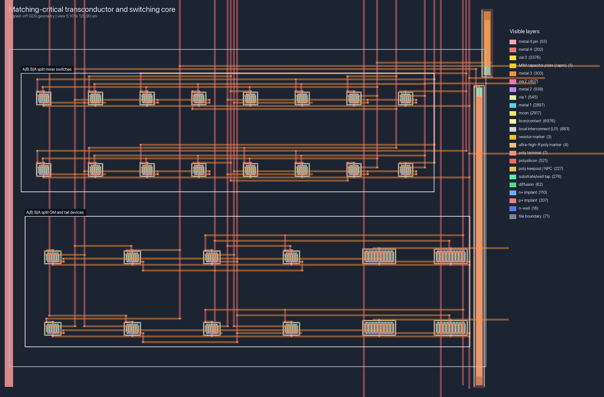
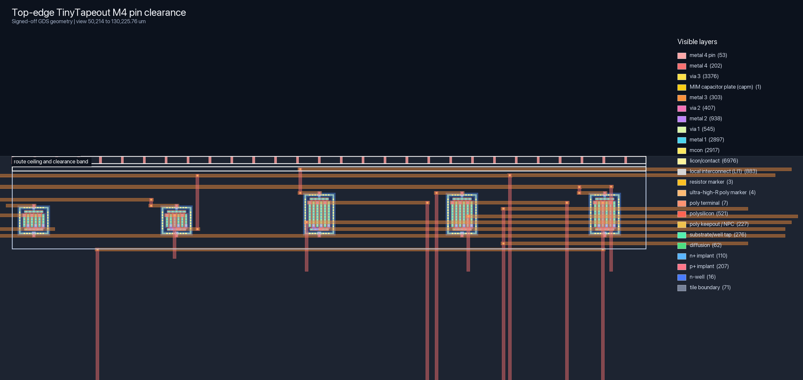
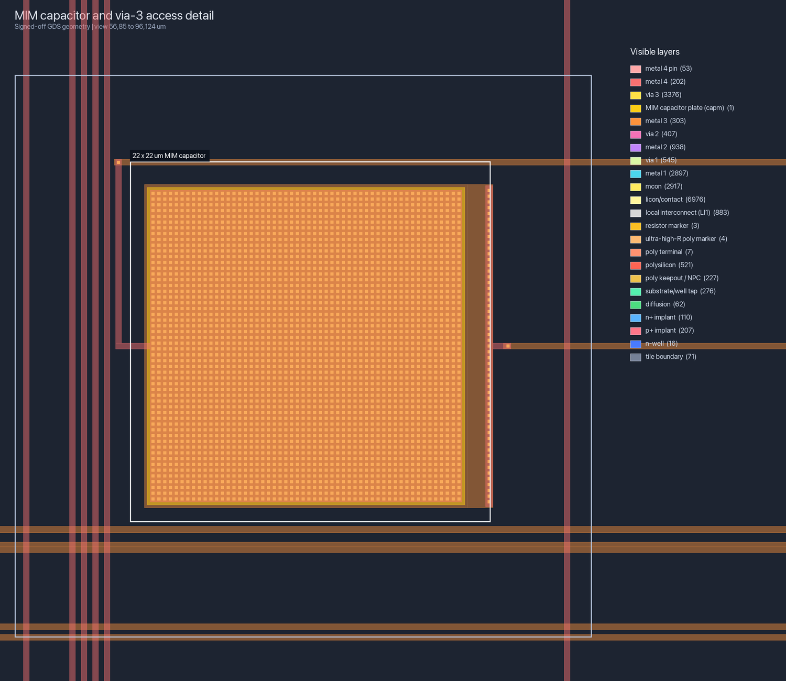
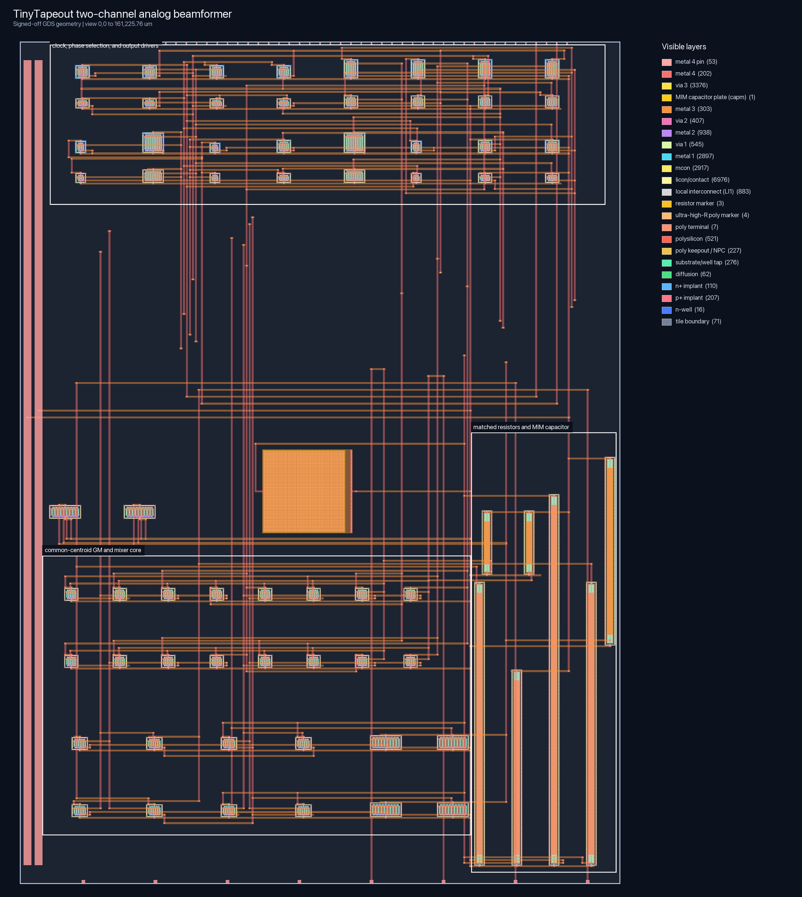

# TT-BF1 two-channel low-IF beamformer

Engineering datasheet and iteration handoff, release candidate 1.3

Target: TinyTapeout SKY130 `ttsky26c`

Top macro: `tt_um_jjassonn69_beamformer`

Date: 2026-07-20

## 1. Document purpose and status

This document records what was designed, why the architecture was chosen, how
the implementation was produced, what has actually been verified, and what is
still unknown. It is both the first-silicon datasheet and the starting context
for the next beamformer iteration.

The design is a pre-silicon release candidate. Values labeled *simulated* are
not production guarantees. No packaged silicon has been measured yet, and the
shuttle pad, ESD, package, board, mismatch, noise, and linearity behavior is not
fully characterized. Do not infer absolute-maximum ratings from the simulated
PVT envelope.

## 2. Product summary

TT-BF1 is a two-channel, binary-weight, narrowband receive beamformer for
phase-coherent 5 MHz intermediate-frequency inputs. A shared 4 MHz local
oscillator commutates both channel currents. Channel 2 can use the normal or
exchanged LO polarity, providing a selectable 0- or 180-degree weight. The
channel currents sum into a differential resistive load, and the useful 1 MHz
difference-frequency output is selected by an external low-pass filter.

The first iteration deliberately solves the smallest useful on-chip problem:
coherent two-channel combining and cancellation. Input impedance matching, an
LNA, antenna interface, RF phase shifting, and the final output filter remain
off-chip. This keeps the experiment within one 1x2 analog tile and avoids
making package- and board-dependent RF structures before their parasitics are
known.

### Key features

- two phase-coherent, AC-coupled, high-impedance inputs;
- differential 1 MHz beamformed output with the input set 1 MHz above the LO;
- binary 0/180-degree weight on channel 2;
- on-chip complementary LO generation and phase selection;
- shared on-chip bias, input common mode, resistive output load, and MIM
  decoupling;
- 4 MHz nominal operation plus extracted 10, 20, and 30 MHz clock
  characterization;
- A/B; B/A common-centroid channel devices, mirrored equal-valued passive
  pairs, and a ratio-controlled VCM divider for improved cancellation yield
  and low-supply headroom;
- nominal 1.8 V operation using `VDPWR`; no `VAPWR` dependency;
- 161.00 x 225.76 um 1x2 TinyTapeout analog macro;
- 70 placed SKY130 PCells and 338 extracted MOS fingers;
- committed uncompressed GDSII and exact-template LEF; and
- reproducible golden, schematic-SPICE, extracted-SPICE, PVT, physical, and
  release-integrity checks.

## 3. Functional block diagram

```text
 IF_INPUT_1 -> AC coupling -> bias/GM1 -> commutating mixer 1 ---+
                                                               |
                                                               +-> shared
 IF_INPUT_2 -> AC coupling -> bias/GM2 -> commutating mixer 2 ---+   differential
                                      ^                            load
                                      |
                                  0/180 LO mux                 BEAM_OUT_P
                                      ^                       BEAM_OUT_N
                                      |
 clk 4 MHz -> complementary LO buffers + phase-select control
```

For equal-amplitude, equal-phase inputs, `CH2_PHASE_180=0` produces the
constructive sum. `CH2_PHASE_180=1` exchanges the channel-two LO rails and
produces the destructive null. This is phase inversion, not a true time delay,
so wideband array behavior is outside the v1 scope.

## 4. Pin description

| TinyTapeout pin | Datasheet name | Direction | Function |
|---|---|---:|---|
| `VDPWR` | 1V8_SUPPLY | power | Nominal 1.8 V analog and logic supply. |
| `VGND` | GROUND | power | Supply and signal reference. |
| `clk` | LO_CLK | input | 0-to-`VDPWR`, nominal 4 MHz square-wave LO input. |
| `ui_in[0]` | CH2_PHASE_180 | input | Low: constructive 0-degree channel-two weight. High: inverted 180-degree weight. |
| `ui_in[7:1]` | RESERVED | input | No analog-core function in v1. |
| `ua[0]` | IF_INPUT_1 | analog input | AC-coupled, high-impedance channel-one input. |
| `ua[1]` | IF_INPUT_2 | analog input | AC-coupled, high-impedance channel-two input. |
| `ua[2]` | BEAM_OUT_P | analog output | Positive beamformed output. Use a high-impedance receiver. |
| `ua[3]` | BEAM_OUT_N | analog output | Negative beamformed output. Use a high-impedance receiver. |
| `ua[5:4]` | UNUSED_ANALOG | analog | Not connected by the project macro. |
| `ua[7:6]` | RESERVED_BOUNDARY | analog boundary | Not used by the project. |
| `ena` | RESERVED_ENABLE | input | Boundary-compatible only; the v1 analog core is always active when powered. |
| `rst_n` | RESERVED_RESET | input | Boundary-compatible only; no v1 analog reset function. |
| `uo_out[7:0]` | UNUSED_OUTPUTS | output | Tied low in the wrapper. |
| `uio_out[7:0]` | UNUSED_BIDIR_OUT | output | Tied low in the wrapper. |
| `uio_oe[7:0]` | UNUSED_BIDIR_OE | output | Tied low; bidirectional digital pins remain inputs. |

### Phase-select truth table

| `CH2_PHASE_180` | Channel-two weight | Equal-phase input result |
|---:|---:|---|
| 0 | 0 degrees | Constructive sum |
| 1 | 180 degrees | Destructive null |

The select input is static CMOS control. Avoid changing it during a precision
measurement until phase-select transient behavior is characterized.

## 5. Recommended operating conditions

These are intended operating conditions for the first bench experiment, not
foundry absolute-maximum ratings.

| Parameter | Recommended value | Verification envelope | Notes |
|---|---:|---:|---|
| `VDPWR` | 1.80 V | 1.62 to 1.98 V simulated | Use a quiet, current-limited supply. |
| Temperature | 27 C | -40 to 125 C simulated | Package behavior is not included. |
| LO frequency | 4 MHz | 4, 10, 20, 30 MHz nominal-extracted characterization | 0-to-`VDPWR` square wave; 4 MHz is the release operating point. |
| Input frequency | 5 MHz | `LO + 1 MHz` characterized | Two phase-locked sources. |
| Useful output | 1 MHz | 1 MHz signoff point | Difference product, measured differentially. |
| Input amplitude | 10 mVpp/channel | 10 to 30 mVpp intended | AC-coupled; compression is not yet characterized. |
| Input common mode | Internally biased | approximately two-thirds of `VDPWR` (1.20 V nominal) | Do not externally force DC common mode. |
| Output load | high impedance | 1 Mohm fixture; 0 to 10 pF planned sweep | Never terminate either output directly in 50 ohms. |
| External LPF | approximately 2 MHz | two-pole simulation fixture | Required to reject higher mixer products. |

Every signal pin must remain between `VGND` and `VDPWR`. The actual shuttle
pad/ESD limits must be confirmed before connecting laboratory equipment.

## 6. Interface and impedance guidance

### Inputs

Each input is biased toward the shared on-chip common-mode node through an
approximately 100 kohm extra-high-resistance poly resistor. This makes the
interface high impedance at low IF, but the complete complex input impedance
also includes transistor, route, pad, ESD, package, and board capacitance. A
50-ohm match is therefore neither implemented nor claimed.

Drive each input through an AC-coupling capacitor from a phase-coherent source.
A bench source may retain its own 50-ohm source impedance; do not add a 50-ohm
shunt termination at the chip pin unless a separate attenuator or matching
network was intentionally designed for it.

### Why the 50-ohm match is off-chip

- the desired match depends on the package, pad, ESD, board, antenna, and test
  fixture rather than the core alone;
- a broadband resistive 50-ohm input would heavily load a small 1.8 V core;
- high-Q inductors, transformers, and transmission-line phase shifters are not
  efficient uses of a 1x2 SKY130 TinyTapeout tile; and
- an off-chip network can be changed after the actual silicon parasitics are
  measured.

For a later RF-facing version, measure the assembled input S-parameters first,
then co-design the external match or a dedicated on-chip LNA input stage.

### Outputs

The differential outputs are loaded on-chip by matched approximately 2.93
kohm high-resistance poly devices to `VDPWR`. Measure `BEAM_OUT_P -
BEAM_OUT_N` with a high-impedance differential probe or instrumentation
amplifier. Direct 50-ohm termination would collapse the intended gain and alter
the common mode.

## 7. Circuit architecture

### 7.1 Shared bias and common mode

A diode-connected NMOS implemented as two matched 16 um/0.50 um units and an
approximately 10.60 kohm poly resistor generate the shared bias. Approximately
66.77 kohm top and 133.54 kohm bottom extra-high-resistance poly devices
generate an approximately two-thirds-of-`VDPWR` common-mode reference. The divider
retains the original total resistance while providing output headroom at
low-supply/slow-process corners. It is decoupled by a 22 x 22 um M3 MIM
capacitor of approximately 0.983 pF.

### 7.2 Channel transconductors

Each channel uses a matched NMOS single-ended-to-differential transconductor.
Each effective 16 um/0.30 um input device is split into two 8 um halves, and
each 38 um/0.50 um tail is split into two 19 um halves. Corresponding channel
halves use the two-dimensional A/B; B/A ordering described in Section 9. One
gate sees the AC-coupled input and the other sees the common-mode reference.

### 7.3 Commutating mixers

Four effective 16 um/0.15 um NMOS switches per channel steer the
transconductor currents according to complementary LO rails. Every switch is
implemented as two 8 um halves in the same A/B; B/A channel pattern. Both
channels connect to the same
differential output load, so current summation is intrinsic rather than
implemented by a separate op-amp summer.

### 7.4 LO generation and binary phase weight

The single-ended `clk` input drives sized multistage CMOS inverter paths that
generate buffered complementary rails. Four CMOS transmission gates select
normal or exchanged LO polarity for channel 2. Matched post-selector inverters
restore full swing and isolate the mixer-gate capacitance from the mux. The
final drivers were strengthened for the doubled switch width, and each channel
now traverses the same selector-plus-restoration topology so its clock loading
and logical depth remain comparable.

### 7.5 Passive inventory

| Function | Count | PDK device | Extracted/simulated nominal value |
|---|---:|---|---:|
| Output load | 2 | `res_high_po_1p41` | approximately 2.93 kohm each |
| Bias resistor | 1 | `res_high_po_1p41` | approximately 10.60 kohm |
| Input bias | 2 | `res_xhigh_po_1p41` | approximately 100.15 kohm each |
| VCM divider | 2 | `res_xhigh_po_1p41` | approximately 66.77 / 133.54 kohm (1:2 top/bottom ratio) |
| VCM bypass | 1 | `cap_mim_m3_1` | approximately 0.983 pF |

All passives are predefined SKY130 PCells. Their physical geometry is generated
by the pinned open_pdks/Magic device generators rather than hand-drawn from
foundry layers.

## 8. Electrical simulation results

### 8.1 Measurement definitions

The higher-speed sweep uses a coherent quadrature detector at the intended
1 MHz difference tone. For every LO frequency, the input frequency is `LO +
1 MHz`. This rejects switching carrier and unrelated mixer products and is the
best measure of useful beamformer output. The PVT regression retains the older
time-domain RMS measurement after the testbench filter; it is deliberately a
broader metric and therefore gives a more conservative null number. Results
from those two detectors must not be compared as if they were the same unit.
The local harness encodes that distinction explicitly: `make layout-sim`
applies the 20 dB release gate to the broad time-domain RMS detector, while
`make layout-frequency-sweep` independently records both the 40 dB nominal
target and the 20 dB release gate at the coherent wanted tone.

All extracted tests use `build/layout/extracted_rc.spice`, the final
distributed-resistance and capacitance netlist, with TT primitive models unless
otherwise stated, 1.8 V, 27 C, equal 10 mVpp inputs, and paired constructive and
destructive runs with equal settling time. The frequency testbench already
includes 500 ohm series plus 5 pF shunt loading on each input and 500 ohm
series plus 10 pF shunt loading on each output, followed by a high-impedance
receiver. These are conservative emulated pad/fixture parasitics, not a claim
that the eventual package has those exact values.

### 8.2 Clock-frequency and wanted-tone characterization

| LO | Input | Constructive 1 MHz tone | Null | 40 dB target | 20 dB release gate |
|---:|---:|---:|---:|---:|---:|
| 4 MHz | 5 MHz | 0.9999 mVrms | 66.96 dB | pass | pass |
| 10 MHz | 11 MHz | 1.1594 mVrms | 44.30 dB | pass | pass |
| 20 MHz | 21 MHz | 1.1599 mVrms | 41.96 dB | pass | pass |
| 30 MHz | 31 MHz | 1.1594 mVrms | 38.84 dB | miss | pass |

The wanted-tone amplitude remains approximately 1.0 to 1.16 mVrms throughout
the sweep; the 30 MHz result is 116.0 percent of the 4 MHz amplitude. The
30 MHz mode is nevertheless characterization-only: only 4 MHz is carried as
`clock_hz` in the TinyTapeout metadata and through the complete release matrix.
The principal higher-speed degradation is cancellation depth, not gain or
failure of the clock drivers.

An independent macOS replay with ngspice 46 and the same extracted-netlist
hash measured 0.9335 mVrms constructive output and 52.52 dB null at 4 MHz.
Very deep cancellation is numerically sensitive to solver version, so both
solver results are preserved rather than silently selecting one. Both
independently clear the 40 dB nominal target.

### 8.3 Extracted clock integrity

Dedicated extracted-clock simulations independently measure the complementary
and per-channel LO rails. All four clock points pass rail, edge-time,
complement-skew, and paired-channel-skew gates. The rail gate now rejects both
undershoot below -0.10 V and overshoot above 1.90 V rather than checking only
that a logic threshold was crossed.

| LO | Slowest measured edge | Worst paired-channel skew | Result |
|---:|---:|---:|---:|
| 4 MHz | 0.193 ns | 0.024 ns | pass |
| 10 MHz | 0.190 ns | 0.022 ns | pass |
| 20 MHz | 0.192 ns | 0.021 ns | pass |
| 30 MHz | 0.188 ns | 0.022 ns | pass |

At 30 MHz the measured selected-rail extrema are approximately -12 mV and
1.868 V in the ideal-pad testbench. These small overshoots should be rechecked
with shuttle pad, package, and board models before treating 30 MHz as a field
rating.

### 8.4 Nominal channel balance

Driving each channel independently through the same extracted testbench gives
0.0016874 percent nominal amplitude difference. The amplitude-only
cancellation estimate is 101.48 dB; the actual switched two-channel null is
lower because phase skew, residual clock products, and detector bandwidth also
contribute.
This is a deterministic result, not a yield prediction.

### 8.5 Random-mismatch surrogate

The open SKY130 model files contain Spectre `statistics` blocks that ngspice
cannot execute. A reproducible 30-trial surrogate therefore applies the SKY130
NMOS threshold Pelgrom slope of 3.356 mV-um to the channel input and tail
devices and adds independent 0.5 percent load-resistor variation. With seed
130, all 30 trials pass the 20 dB requirement: the worst null is 39.22 dB, the
empirical fifth percentile is 39.72 dB, and the median is 49.01 dB.

The input-device one-sigma threshold offset is 1.532 mV for 16 um x 0.30 um;
the tail value is 0.770 mV for 38 um x 0.50 um. This test is valuable evidence
that the larger devices have margin, but it is not native foundry Monte Carlo:
it does not yet randomize every switch, PMOS, interconnect, capacitor, or
spatially correlated parameter. A foundry-qualified Spectre mismatch run
remains a pre-fabrication recommendation.

### 8.6 Deterministic extracted PVT matrix

The release matrix covers TT, SS, FF, SF, and FS process corners; 1.62, 1.80,
and 1.98 V supplies; and -40, 27, and 125 C temperatures. Each case contains
equal-duration constructive and destructive simulations. The committed JSON
report is the authoritative source for all 45 cases; its summary is inserted
into `submission/signoff.json` by the release process.

Each case requires more than 1 mVrms constructive output, at least 20 dB null,
common mode above 1.0 V with at least 0.10 V headroom below the active swept
supply, less than 1 mA supply current, and less than 10 percent sum/null
current difference. The headroom rule scales correctly through the intentional
1.62-to-1.98 V supply characterization; it does not impose a fixed 1.75 V
ceiling at the 1.98 V cases.

| Metric | Final extracted result |
|---|---:|
| Cases passed | 45/45 |
| Release requirement | at least 20 dB null in every case |
| Minimum null | 31.04 dB at TT, 1.62 V, 125 C |
| Maximum null | 48.85 dB |
| Constructive time-domain RMS range | 5.621 to 32.614 mVrms |
| Output common-mode range | 1.335 to 1.668 V |
| Supply-current range | 0.145 to 0.426 mA |

The nominal TT, 1.80 V, 27 C time-domain result is 16.783 mVrms
constructive, 0.196 mVrms destructive, 38.63 dB null, 1.504 V common mode,
and 0.323 mA. Its null is lower than the 66.96 dB coherent wanted-tone result
because the time-domain detector also includes residual filtered switching
products, as described in Section 8.1.

### 8.7 Schematic and block regressions

- integrated schematic nominal: 5.815 mVrms constructive output and
  approximately 0.375 mA current;
- ideal 1 dB gain/8 degree phase-error envelope: 20.3701 dB null;
- transistor mixer 1 dB/8 degree error envelope: 20.3721 dB null;
- bias reference and passive PDK smoke tests pass for the pinned model set; and
- refreshed schematic 45-case PVT: 45/45 pass with an 81.08 dB minimum null
  and 0.292 V minimum output high-side headroom;
  it remains a topology-level cross-check, while the final extracted matrix
  supersedes its numerical result.

## 9. Physical implementation

| Item | Implemented value |
|---|---|
| Tile | official TinyTapeout 1x2 analog boundary |
| Macro size | 161.00 x 225.76 um |
| Placed PCells | 70: 62 MOSFETs, 7 resistors, 1 MIM capacitor |
| Extracted MOS fingers | 338 |
| Extracted passives | 8 |
| Generated terminal routes | 271 on 30 named tracks |
| Generated route geometry | 7,214 nonzero-area shapes; overlap, connectivity, and top-pin audits passed |
| Signal routing | local M2, compact M3 tracks, shared local M4 risers |
| Power | `VDPWR` and `VGND`; no `VAPWR` |
| GDS size | 755,306 bytes, uncompressed GDSII |
| GDS SHA-256 | `6d620f373932d0711c67ad4c22a11ba384e06a75e74e4e4b50b79239ed66c609` |
| LEF SHA-256 | `9df231957326895371afc1f5e903b51e7992b3b6f8c3401546fa7ef7d82eb760` |
| Distributed-RC SPICE SHA-256 | `9b4d802906e882d9df5c23f9ede787415a0bb79b1a14d98dd36da32883327a24` |
| Official DEF SHA-256 | `042803101760925474f602e69119f497922eb912c37a6651bed030164bb576af` |

### 9.1 Matching architecture

The earlier version placed whole channel-one and channel-two blocks in
separate regions. The final version replaces every matching-critical channel
device with equal halves and places the halves as A/B on the first row and B/A
on the second. The centroids of channels A and B are therefore coincident for
each transconductor input, reference device, tail, and mixer-switch group. The
equal input-bias and output-load resistors are mirrored around their pair axes.
The unequal VCM divider retains its deliberate 1:2 resistance ratio and
symmetric local breakout rather than being described as an equal matched pair.
Device orientation, finger count, local contacts, and breakout direction are
held equal within every actual matched pair.

This structure strongly rejects first-order linear process gradients and makes
local route parasitics much closer. It cannot remove microscopic random
mismatch; the larger effective GM and switch devices plus the surrogate Monte
Carlo quantify the available margin against that residual.



### 9.2 Parasitic controls for higher clock rates

- the final LO inverters were strengthened to drive the doubled switch-gate
  width;
- both channels use the same transmission-gate and restoration-inverter depth;
- clock breakouts are staggered locally instead of sharing long lower-metal
  detours;
- compact M3 tracks and local M4 risers reduce long parallel runs and avoid
  unnecessary via stacks;
- M2 is used for short device-terminal escape rather than long global nets;
- the router forbids both vertical M4 and horizontal M3 crossings through the
  full MIM-capacitor footprint;
- ordinary route breakouts stop below a full-width top-edge keep-out, and an
  independent audit models every standard TinyTapeout top M4 pin; and
- generated same-layer/via-to-metal overlap and disconnected-island checking
  runs before Magic,
  followed by extraction
  feedback, unexpected-net-equivalence checks, and an explicit distributed-RC
  coverage gate.

The router also emits `route_matching.json` from the exact generated TCL.
Required constraints cover aggregate analog inputs/outputs, GM and tail nets,
both input-GM branches, both output loads, and all eight switch-drain output
branches. They compare unioned M3/M4 length (so duplicate paint and via landing
pads are not double-counted) plus via-site equality or an explicit small via
delta. Cross-net same-layer overlap is always fatal. LO wire-length/path
comparisons remain diagnostic because the branched clocks cannot be judged
reliably by one aggregate Manhattan number; their release gate is the actual
zero-pruning extracted transient, with <50 ps paired-channel skew, <150 ps
complement skew, and <250 ps edge time required at 4, 10, 20, and 30 MHz.

The routed device escapes are 0.32 um on M2; named M3/M4 tracks and risers are
0.40 um. These widths satisfy SKY130 minimum geometry while avoiding the
excessive capacitance of making every local signal a wide power-style strap.
The exact unioned-length constraint results are:

| Matched route set | Required total-length limit | Measured mismatch |
|---|---:|---:|
| Analog input pins `ua[0]` / `ua[1]` | <=2.0% and equal via counts | 1.397% |
| Differential output pins `ua[2]` / `ua[3]` | <=1.0% and equal via counts | 0.935% |
| Channel GM positive / negative | <=2.0% | 0.121% / 0.427% |
| Channel tail-current nets | <=2.0% | 0.126% |
| Upper / lower input-to-GM endpoints | <=2.0% | 0.746% / 1.510% |
| Differential output-load endpoints | <=2.0% | 0.213% |
| Eight switch-drain-to-output endpoint pairs | <=2.0% | 1.312% to 1.929% |

All required endpoint pairs also have equal via-1, via-2, and via-3 counts;
the only explicit exceptions are the aggregate internal GM/tail trees, whose
via-3 deltas are bounded because their legal local branches are asymmetric.
This answers pin-length matching separately from device matching: the P/N
outputs and both analog inputs are constrained all the way to their boundary
pins, while individual critical device endpoints are constrained as their own
pairs.



### 9.3 What each visible GDS layer does

| Layer family | Function in this design |
|---|---|
| n-well | Encloses PMOS bodies and their well taps. It is not a conductor between unrelated nets. |
| diffusion and implants | Form NMOS/PMOS source-drain active areas and explicit substrate/well taps. |
| polysilicon | Crosses active diffusion to form transistor gates; elsewhere it is routing or the body of a poly resistor. |
| licon/contact and LI1 | Connect an approved diffusion, tap, or poly-contact landing to local interconnect. |
| mcon, metal 1, via 1 | Raise device-local LI1 nodes into the first general routing metal. |
| metal 2, via 2, metal 3 | Carry short breakouts and the dense named signal tracks. |
| capm | The special upper electrode of the predefined M3 MIM capacitor. |
| via 3 and metal 4 | Contact the MIM upper electrode where defined by the PCell and carry global risers and pins. |
| metal-4 pin and boundary | Expose the exact TinyTapeout LEF/GDS pins and macro extent. |
| resistor/NPC markers | Tell the PDK extractor which poly geometry is a defined resistor and where contacts are prohibited. |

The many small licon rectangles do not directly short substrate to LI1. A
licon is only the cut; what it connects depends on its legal landing. On a
source/drain it lands on implanted diffusion, on a gate it lands on a defined
poly-contact structure, and on a substrate or n-well tap it intentionally ties
the body to `VGND` or `VDPWR`. Magic DRC, exact extraction, and the
unexpected-net-equivalence check all pass, so the release GDS contains no
detected licon-induced signal/body short.

Poly may geometrically run across n-well outside diffusion. That crossing is
not a MOS device: a gate exists only where poly crosses active diffusion. For a
PMOS, the active diffusion itself is inside n-well; for an NMOS, it is in the
p-type substrate region. Poly outside active can therefore be visible over a
well without creating a transistor or shorting to the well.

### 9.4 MIM capacitor, capm, and via 3



The dense via-3 array overlapping the capm plate is intentional internal
geometry of `sky130_fd_pr__cap_mim_m3_1`: capm is the upper electrode and the
array connects that electrode to metal 4. The other electrode is metal 3. The
unsafe condition would be an unrelated M3 or M4 route crossing the broad PCell
footprint and being interpreted as an electrode connection. The final router
uses a full two-dimensional keep-out and takes both `vcm` and `VGND` exits off
the designated access sides. Extracted `vcm` and `VGND` remain distinct, the
capacitor is present once, and GDS readback DRC and extraction feedback are
both zero.

### 9.5 Signed-off full layout



These figures are parsed directly from the committed GDSII hierarchy. They are
not a schematic, a Magic source-cell screenshot, or a post-fabrication
micrograph.

### 9.6 Distributed-RC extraction views

The extraction flow deliberately produces three different netlists so their
purposes cannot be confused:

| View | Contents | Use |
|---|---|---|
| `extracted.spice` | devices plus all extracted capacitances; no explicit route resistors | device/topology reference |
| `extracted_rc.spice` | devices, capacitances, and Magic `.res.ext` resistor networks | every post-layout electrical regression |
| `extracted_lvs.spice` | devices with parasitic C/R suppressed | topology/LVS-style comparison |

`ext2spice rthresh 0` alone does not create a distributed network. The pinned
Magic 8.3.676 flow first sets `extresist threshold 0`, `mindelay 0`, and
`minres 0`, disables simplification, and runs `extract do resistance`. Only
then does `ext2spice extresist on` consume the generated `.res.ext` files.
Consequently the simulation view is a literal zero-pruning network, not a
lumped-R estimate or a capacitance-only extraction.

`tools/check_distributed_rc.py` compares the views and fails unless the
resistance annotation is fresh, explicit positive resistor segments and
internal nodes exist, the device count is preserved, capacitance is
distributed onto the new nodes, all 30 manifest electrical nets appear in the
resistor graph, and every resistor-network component is anchored to one of
those nets. The signed submission evidence also freezes the exact RC
netlist, its hash, and this coverage report.

## 10. Physical and submission verification

The following checks are complete for the local release candidate:

- Magic placement, routed-layout, extraction-stage, and internal final DRC:
  zero errors at every stage;
- Magic GDS-writer feedback and extraction feedback: zero;
- official Magic readback DRC on the emitted GDS: zero errors;
- official TinyTapeout GitHub Action precheck: 15/15 checks pass, including
  Magic DRC, KLayout FEOL/BEOL/off-grid/zero-area checks, pin and boundary
  checks, analog-pad connectivity, layer and cell-name checks, and Verilog;
- extraction topology: 338 MOS fingers, eight passives, connected power, one
  MIM capacitor, and no unexpected net equivalences;
- exact extracted-device and parasitic-capacitor multisets agree with the
  resistance-free extraction reference;
- distributed-RC coverage: 11,368 explicit SPICE resistors, 6,382 capacitors,
  6,559 internal resistor nodes, 6,364 top-level route annotations, exactly 30
  manifest-anchored resistor components, and zero floating extracted
  components;
- generated route same-layer/via/connectivity/top-boundary audit: pass for
  7,214 nonzero-area generated shapes and zero disconnected same-net
  components;
- dependency-free flattened-GDS audit: zero M3 spacing, M4 spacing, M4 width,
  M4 connected-area, or capm-to-unrelated-M3 markers;
- official static prechecks: 8/8 locally runnable checks pass, covering top
  macro, forbidden layers, project boundary, exact DEF/LEF/GDS pin geometry,
  power pins, valid layers, cell names, analog-pad connectivity, and Verilog;
- release integrity authenticates GDS, LEF, reports, plain GDSII header, macro
  dimensions, 53 LEF pins, zero physical-error counters, and required metadata;
  and
- the post-precheck GitHub `release-evidence` job independently repeats the
  frozen-report and documented-metric consistency gates on Ubuntu.

The project-local GDS audit deliberately flattens the exact emitted hierarchy.
It was regression-tested against the first independent-precheck failure and
reproduced all 9 M3 spacing, 12 M4 spacing, 176 M4 connected-area, and two capm
markers from the first independent precheck, then the two M4-width markers
from the second pass. Synthetic unit cases independently require every escaped
rule class to produce a marker and require clean reference geometry to produce
none. The exact release-GDS regression and those detector tests now run from
`make verify`, `make layout-signoff`, `make release-check`, and before the
custom-GDS Action.
The separate generated-route audit runs on the exact route TCL immediately
before Magic paint; its report must be newer than the route generator and
manifest when evidence is frozen, and those sources are then hash-locked.
Synthetic route tests in `make verify` and CI cover same-layer overlap,
cross-net via landing, disconnected same-net islands, top-pin clearance,
endpoint matching, and path-matching failure modes without requiring a local
PDK installation.
The extraction gates separately reject unexpected net equivalences, an
incorrect 338-finger/eight-passive device multiset, missing `.res.ext`
annotations, an RC view without explicit resistor/internal nodes, changed
device count, or any manifest net omitted from the resistor graph.
The physical Make dependency graph always regenerates placement before route
paint and route paint before extraction. This matters because Magic paint is
additive: without the dependency, rerunning two route revisions in the same
buffered cell can create a short even when each generated script independently
passes its source-geometry audit.

The same audit found that the previously tracked schematic PVT JSON predated
the clock/matching schematic edit. The final release reruns that full matrix,
copies it only from `build/` during evidence freezing, rejects reports older
than their primary inputs, and records the input hashes. This is why report
freshness is now a release invariant rather than a manual assumption.

That rerun also exposed a real low-supply slow-corner bias weakness that the
old fixed 1.75 V common-mode ceiling obscured. The gate now checks both a
1.0 V receiver-side floor and at least 0.10 V of headroom below the active
swept supply. The VCM divider was changed from 1:1 to a fixed-total-resistance
1:2 ratio, moving the input reference to approximately two-thirds of `VDPWR`; the
complete schematic and distributed-RC PVT matrices were then restarted from
the changed source/netlist. Unit tests independently prove that the
supply-relative rule accepts a safe high-supply point and rejects inadequate
headroom. This closes the specific path by which an absolute threshold and a
stale report could previously appear clean while hiding lost analog margin.

The GitHub workflow remains the final mechanical submission gate because it
runs the complete pinned TinyTapeout Magic and KLayout rule set. The exact
release GDS passed
[run 29713672666](https://github.com/JJassonn69/ttsky-beamformer/actions/runs/29713672666);
the committed
`submission/official_precheck_results.md` and
`submission/official_magic_drc.txt` preserve that run's reports. The
`submission/official_action.json` attestation binds that successful run and
both reports to the exact release-GDS SHA-256; evidence freezing and
`make release-check` reject a stale report after any future GDS change. A green
workflow establishes compatibility with that submission flow; it does not
prove analog yield. The topology checker is also not a second,
foundry-qualified LVS engine, so an independent LVS remains desirable before
paying for fabrication.

## 11. Tool and source provenance

| Component | Pinned revision/version |
|---|---|
| TinyTapeout analog template | `fdd487cb8e3003b40496f0f143ff3bf650f78e48` |
| TinyTapeout GDS action | `ttsky26c`, commit `30d38a7dfc6fda561d452b196fc822af0332ec23` |
| TinyTapeout support tools | `d65690eeb1d4afd26aef795c805a23d9d9daf9d1` |
| SKY130 precheck PDK | `0536d02d875c8f67dd7cca3902ac457e62f20005` |
| SKY130 primitive simulation models | `f62031a1be9aefe902d6d54cddd6f59b57627436` |
| Magic | 8.3.676 |
| KLayout precheck library | 0.30.8 |
| Primary extracted matrix/sweeps | ngspice 44.2 on Ubuntu |
| Independent cross-check | ngspice 46 on macOS, 4 MHz exact-RC wanted-tone case |

Only the sparse primitive model checkout is required for local schematic and
extracted simulation. The complete PDK is required for PCell generation,
extraction, and DRC. The external model checkout is intentionally excluded from
the repository and can be recreated from `third_party/README.md`.

## 12. Reproduction procedure

### Electrical verification

```sh
make verify
make pvt
make layout-sim
make layout-balance
make layout-clock-sweep
make layout-frequency-sweep
make layout-pvt
make mismatch-mc
```

### Physical generation and signoff

With `PDK_ROOT` pointing to the pinned `sky130A` installation and `MAGIC_BIN`
set when Magic is not on `PATH`:

```sh
make layout-scripts
make layout-place
make layout-route
make layout-extract
make layout-signoff
python3 tools/render_gds.py gds/tt_um_jjassonn69_beamformer.gds
make submission-evidence
make release-check
```

The deterministic source of physical intent is `layout/circuit.json` together
with the layout-script generators. The fabrication views are
`gds/tt_um_jjassonn69_beamformer.gds` and
`lef/tt_um_jjassonn69_beamformer.lef`. Machine-readable evidence is stored in
`submission/signoff.json`, `submission/core_pvt_summary.json`,
`submission/extracted_pvt_summary.json`,
`submission/extracted_frequency_sweep.json`,
`submission/extracted_clock_sweep.json`,
`submission/extracted_channel_balance.json`,
`submission/distributed_rc_coverage.json`,
`submission/route_matching.json`,
`submission/mismatch_mc_summary.json`, and the GDS-bound official Action
attestation in `submission/official_action.json`. The independent solver replay
is preserved in `submission/independent_ngspice46_frequency_crosscheck.json`.
`submission/extracted_rc.spice` is the exact zero-pruning simulation netlist.
`submission/simulation_inputs.json` binds the frozen reports to that extracted
SPICE, the testbenches, runners, and corner-include hashes. Evidence freezing also
rejects a generated report older than any of its primary inputs.

## 13. First-silicon bench procedure

### Required equipment

- current-limited, low-noise 1.8 V supply;
- two phase-locked, independently phase-adjustable 5 MHz sources;
- one 0-to-1.8 V 4 MHz clock source;
- two input AC-coupling networks;
- high-impedance differential probe or instrumentation receiver;
- approximately 2 MHz external low-pass filter; and
- automated acquisition capable of sweeping relative input phase.

### Bring-up sequence

1. Verify board continuity and the actual shuttle pinout with power removed.
2. Set the supply current limit conservatively and power `VDPWR` at 1.8 V.
3. Record quiescent current before applying input or clock signals.
4. Apply the 4 MHz LO and confirm supply current remains stable.
5. Apply one AC-coupled 5 MHz input at the minimum planned amplitude, then the
   second input.
6. With `CH2_PHASE_180=0`, adjust equal input phase and record the constructive
   1 MHz differential output after the external filter.
7. Set `CH2_PHASE_180=1` and record the destructive output without changing
   source amplitude.
8. Sweep channel-two phase through 360 degrees and save amplitude, phase,
   common mode, current, and raw spectra for both select states.
9. Repeat at safe supply, amplitude, output-capacitance, and temperature points
   only after the nominal result is understood.

### Measurements to preserve for iteration two

- per-channel gain and phase with the other input disabled externally;
- measured input impedance or S-parameters of the assembled pad/package/board;
- sum and null depth versus relative phase and amplitude;
- LO feedthrough and every visible mixer product;
- output common mode, available swing, and load sensitivity;
- supply current and supply pushing;
- noise spectrum, compression, two-tone IM3, and recovery after phase select;
  and
- die/board temperature and exact equipment calibration records.

## 14. Known limitations and open risks

1. The 30-trial foundry-slope mismatch surrogate is not native Spectre Monte
   Carlo and is too small to establish production-yield confidence.
2. The present extraction topology checker is not a second, foundry-qualified
   LVS implementation.
3. The exact shuttle pad/ESD, package, bond-wire, and board networks are not
   available. Reported higher-speed simulations use conservative lumped
   input/output loads, which are evidence of margin but not a package model.
4. Noise, compression, IIP3, LO feedthrough, supply rejection, and phase-select
   transients have not passed a release characterization matrix.
5. Independent input path resistance and capacitance, output capacitance, LO
   duty cycle, source amplitude, startup phase, and 30 MHz PVT still require
   systematic sweeps.
6. Antenna and density behavior must be reviewed in the assembled shuttle
   context.
7. `ena` and `rst_n` do not shut down or reset the v1 analog core.
8. Binary phase inversion is useful for a narrowband demonstration but does not
   provide multi-angle steering or wideband true-time-delay behavior.

This silicon should therefore be treated as a learning and characterization
vehicle, not a production RF component.

## 15. Iteration-two recommendation

The most effective next architecture is an incremental extension of this same
low-IF current-summing core, not a jump directly to an on-chip RF front end.

### Recommended feature order

1. **Close v1 characterization:** run native foundry mismatch Monte Carlo,
   package/pad sweeps, noise, compression, IM3, feedthrough, independent LVS,
   and the full automated bench rehearsal.
2. **Add real enable control:** use `ena` to shut down the bias and LO buffers;
   retain a defined output state during disable.
3. **Add per-channel observability:** provide a safe diagnostic mode that
   selects channel 1 only or channel 2 only, enabling direct gain/phase
   calibration.
4. **Add small gain trim:** a compact binary current or load trim can correct
   amplitude mismatch before finer phase control is attempted.
5. **Extend to four LO phases:** generate or accept 0/90/180/270-degree LO rails
   and select one per channel for a 2-bit phase beamformer. Keep the shared
   current-summing output and high-impedance low-IF interface.
6. **Add calibration storage/control:** use digital pins for phase and gain
   codes; avoid large analog control buses.
7. **Only then evaluate an RF-facing input stage:** use measured pad/package
   parasitics to choose an external match, on-chip LNA, or both. Do not assume
   50 ohms at the core gate.

### Layout lessons to retain

- use only validated SKY130 PCells for MOS, poly resistors, and MIM capacitors;
- preserve symmetric channel placement, equalized breakout geometry, and
  matched LO paths;
- maintain deterministic route generation and explicit overlap auditing;
- flatten the emitted GDS and check cross-hierarchy M3/M4 spacing, connected
  M4 area, and capm clearance on every change;
- keep extraction feedback at zero before trusting extracted SPICE;
- reread the emitted GDS with the official DRC script rather than checking only
  the in-memory Magic layout; and
- hash every final view and machine-readable report before publication.

## 16. Handoff checklist

Before editing iteration two, archive or tag the green v1 commit and record:

- Git commit and GitHub Actions run URL;
- exact GDS, LEF, and report hashes;
- shuttle identifier and submitted artifact identifier;
- any action/PDK/template version changes since `ttsky26c`;
- all first-silicon raw data and bench scripts;
- measured parasitic model updates; and
- each spec change with an explicit reason and verification test.

When the next design starts, copy this document into the new revision and mark
each numerical table as unchanged, re-simulated, measured, or obsolete. That
prevents a passed v1 assumption from silently becoming an unverified v2
requirement.

## 17. Revision history

| Revision | Date | Description |
|---|---|---|
| RC1.0 | 2026-07-19 | Initial 1x2 binary 0/180-degree low-IF beamformer; GDS/LEF frozen, nominal extracted and 45-corner extracted PVT passing, local physical/release gates passing. |
| RC1.1 | 2026-07-20 | Split A/B; B/A common-centroid GM, tail, and mixer devices; mirrored passives; stronger/equalized LO paths; MIM route keep-out; extracted 4-30 MHz and clock sweeps; mismatch surrogate; regenerated GDS and direct-GDS layer images. |
| RC1.2 | 2026-07-20 | Flattened-GDS cross-hierarchy spacing/width/area/capm regression; corrected M3/M4 and capacitor routing; official 15/15 TinyTapeout precheck pass; GDS-bound Action attestation; detector-specific electrical gates; report freshness and simulation-input locks. |
| RC1.3 | 2026-07-20 | Literal zero-pruning distributed metal-RC extraction; RC-netlist hash binding on every extracted regression; numeric input/output/device endpoint matching constraints; all-top-pin M4 clearance; cross-net via and same-net floating-island rejection; no-op paint removal; supply-relative output-headroom PVT rule; ratio-controlled 1:2 VCM divider with schematic/layout consistency regression; refreshed exact-GDS inspection images and 45-corner evidence. |
