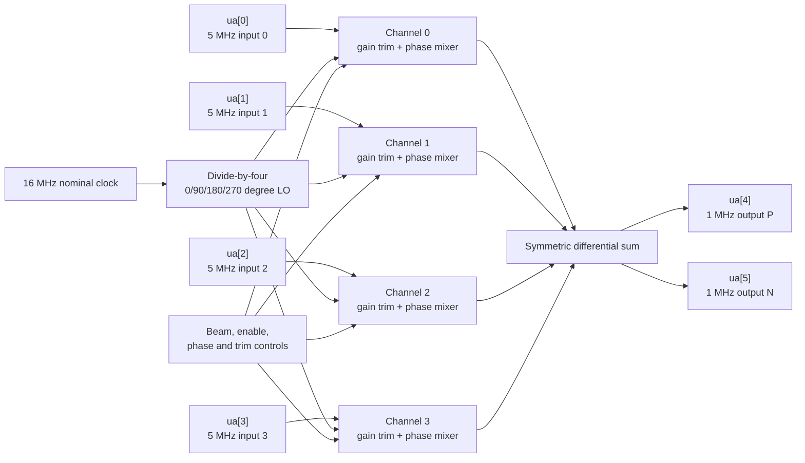
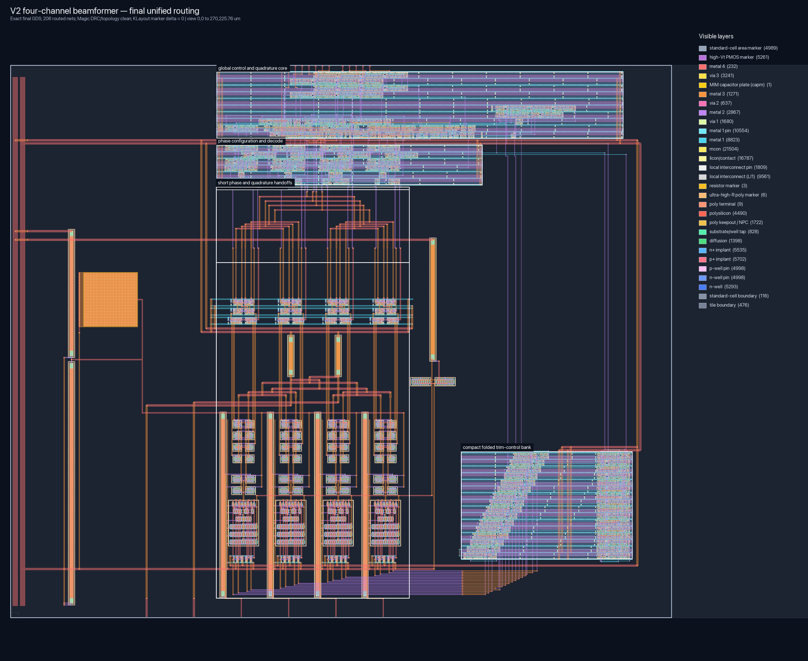
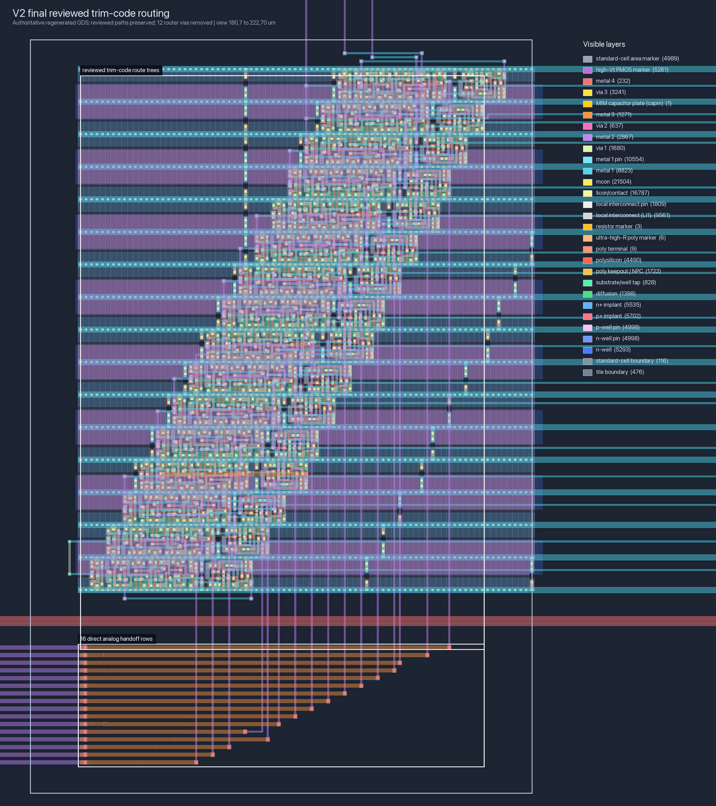
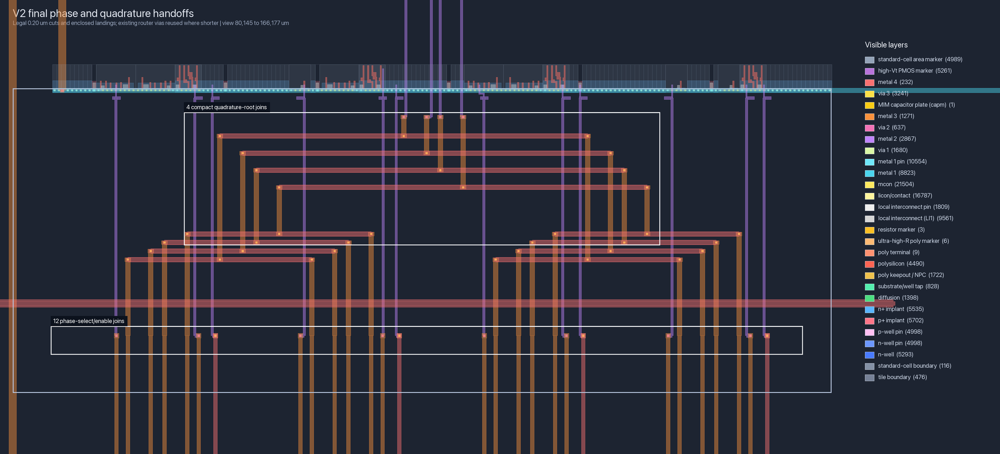
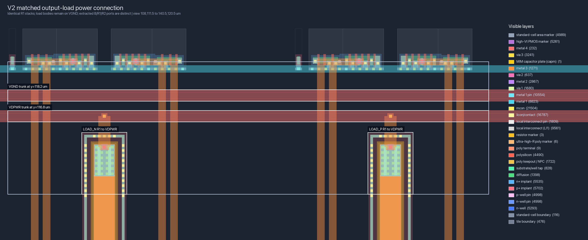

# TinyTapeout four-channel beamformer V2A datasheet

Document status: engineering datasheet for the locally validated V2A physical
candidate. It records the intended interface, architecture, simulations,
layout, limitations, and bring-up plan. It is not a measured-silicon datasheet
and it is not yet an official TinyTapeout submission attestation.

Frozen local layout candidate:

- process: SKY130A;
- top cell: `v2_control_quadrature_routed`;
- file: `build/v2/control_routing/direct/v2_control_quadrature_routed.gds`;
- SHA-256: `d9c9aae5771af815833668374924baee23f60a51747c7966e2517dcb6f6a6130`;
- physical envelope: 334.88 um by 225.76 um TinyTapeout 2x2 analog template;
- release role: V2A four-channel receive beamformer; and
- release blockers: post-layout analog/phase-code simulation, independent
  foundry-qualified LVS where available, final TinyTapeout wrapper, and the
  official GitHub workflow.

## 1. What the chip does

The chip listens to the same narrowband signal on four separate inputs. The
signal reaches each input at a slightly different time. V2A gives each channel
one of four quarter-cycle timing choices, adjusts its strength, and adds all
four channels together. Choosing the right four timing corrections makes the
wanted direction add strongly. Signals matching the other ideal codebook
directions cancel in the mathematical model.

This is a four-state narrowband phase combiner, not a complete radio. It does
not include an antenna, LNA, 50-ohm input match, PA, transformer, ADC, or stored
calibration memory. External AC coupling and a high-impedance measurement or
following stage are required.

With a 5 MHz input and 4 MHz switching LO, the intended difference-frequency
output is 1 MHz. The nominal master clock is 16 MHz because the quadrature
generator divides it by four.

## 2. Scope and feature set

V2A includes:

- four single-ended, AC-coupled, phase-coherent receive inputs;
- four selectable receive codebook beams;
- 0, 90, 180, and 270 degree phase choices per channel;
- manual two-bit phase override per channel;
- independent enable/disable for each channel;
- independent static four-bit gain trim per channel;
- a differential high-impedance combined output;
- atomic control updates at a safe phase boundary; and
- one complete LO period of output blanking during an update.

V2A is receive-only. `ui_in[2]` is reserved low for a possible future V2B
direction control, but the present transconductor/mixer signal path is active
and directional. Driving the output pins does not turn it into a transmitter.

## 3. Intended electrical operating point

The values below are design targets or simulations, not measured production
limits.

| Parameter | Intended value | Evidence level |
| --- | ---: | --- |
| Process | SKY130A | layout target |
| Nominal supply | 1.8 V | design point |
| Element input frequency | 5 MHz | V2A signal-plan target |
| Quadrature LO frequency | 4 MHz | V2A signal-plan target |
| Master clock frequency | 16 MHz | RTL ratio and V2A target |
| Difference-frequency output | 1 MHz | signal-plan target |
| Analog inputs | four single-ended, AC-coupled | architecture contract |
| Analog output | differential, high impedance | architecture contract |
| On-chip 50-ohm termination | none | architecture inspection |
| Gain-trim reset code | 8 per channel | RTL and block simulation |
| Gain-trim relative range | 0.840 at code 0 to 1.140 at code 15 | schematic PVT sweep |

The phase-selector block was also simulated at a 30 MHz LO, but that is not a
chip rating. A 30 MHz LO needs a 120 MHz master clock. The global clock tree,
complete extracted mixer, package loading, clock feedthrough, and four-channel
output must all pass before that faster mode can be advertised.

The trim block was exercised at 1.62, 1.80, and 1.98 V and at -40, 27, and 85 C
for characterization. Those points do not by themselves establish a guaranteed
full-chip supply or temperature range.

## 4. Pin contract

### 4.1 Analog pins

| Pin | V2A function | Connection guidance |
| --- | --- | --- |
| `ua[0]` | element input, channel 0 | AC-coupled, high-impedance source |
| `ua[1]` | element input, channel 1 | AC-coupled, high-impedance source |
| `ua[2]` | element input, channel 2 | AC-coupled, high-impedance source |
| `ua[3]` | element input, channel 3 | AC-coupled, high-impedance source |
| `ua[4]` | combined output P | high-impedance differential receiver |
| `ua[5]` | combined output N | high-impedance differential receiver |

The four inputs are placed on the template's 19.32 um analog-pin pitch and
rise directly into their matching channel slices. `ua[4]` and `ua[5]` are an
electrically matched pair and must be measured differentially.

### 4.2 Digital pins

This is the frozen integration mapping. The final TinyTapeout top-level
wrapper that binds it to a submission template remains to be generated and
verified.

| Pin | Name | Function |
| --- | --- | --- |
| `clk` | master clock | nominal 16 MHz; generates the four 4 MHz LO phases |
| `rst_n` | active-low reset | resets phase, configuration, enables, and blanking |
| `ena` | global enable | enables the clocked phase path and permits channels to unblank |
| `ui_in[1:0]` | `beam_select` | automatic receive beam 0 through 3 |
| `ui_in[2]` | reserved direction | hold low for V2A receive operation |
| `ui_in[3]` | `manual_mode` | 0 = codebook; 1 = serial manual phase codes |
| `ui_in[7:4]` | `channel_enable[3:0]` | one enable bit for each channel |
| `uio_in[0]` | `cfg_clk` | serial configuration clock |
| `uio_in[1]` | `cfg_data` | serial configuration data |
| `uio_in[2]` | `cfg_latch` | commit request, asserted for one separate `cfg_clk` edge |

No functional digital output is required by the V2A analog datapath. The
submission wrapper should drive every unused output to a constant rather than
allowing unused logic to toggle near the analog channels.

## 5. Beam states

Phase code 0, 1, 2, or 3 means 0, 90, 180, or 270 degrees respectively. The
automatic V2A receive weights use the complex conjugate of the transmit-array
reference.

| `beam_select` | CH0 | CH1 | CH2 | CH3 | Packed receive phase code |
| ---: | ---: | ---: | ---: | ---: | ---: |
| 0 | 0 deg | 0 deg | 0 deg | 0 deg | `0x00` |
| 1 | 0 deg | 270 deg | 180 deg | 90 deg | `0x6C` |
| 2 | 0 deg | 180 deg | 0 deg | 180 deg | `0x88` |
| 3 | 0 deg | 90 deg | 180 deg | 270 deg | `0xE4` |

CH0 occupies the least-significant two phase bits. The ideal four codebook
vectors are orthogonal, so a perfectly matched vector selected for one beam
adds constructively and the other three ideal vectors cancel. Real antennas
see continuous arrival angles, gain error, phase error, coupling, and package
parasitics; therefore “destructive everywhere else” is not physically exact.
Measured beam patterns must report main lobe, sidelobes, and grating lobes.

## 6. Serial configuration

The physical implementation splits the serial storage near its consumers so
24 parallel control wires do not cross the macro. The external behavior is one
24-bit shift chain.

Send exactly 24 data bits on rising `cfg_clk` edges while `cfg_latch=0`:

1. Send `trim[0]` through `trim[15]`.
2. Send `manual_phase[0]` through `manual_phase[7]`.
3. Set `cfg_latch=1` for one additional rising `cfg_clk` edge. This edge does
   not shift data.
4. Return `cfg_latch=0`.
5. Keep the direct controls stable while the request crosses into `clk`.

| Packet bits | Meaning |
| --- | --- |
| `[3:0]` | CH0 gain trim |
| `[7:4]` | CH1 gain trim |
| `[11:8]` | CH2 gain trim |
| `[15:12]` | CH3 gain trim |
| `[17:16]` | CH0 manual phase |
| `[19:18]` | CH1 manual phase |
| `[21:20]` | CH2 manual phase |
| `[23:22]` | CH3 manual phase |

For example, packet `0xE48421` requests phase codes CH3..CH0 = 3,2,1,0 and
trim codes CH3..CH0 = 8,4,2,1. Manual phase values are stored even when
`manual_mode=0`; they become active on a later safe update when manual mode is
selected.

Direct inputs and the serial commit cross their clock-domain boundaries with
two-stage synchronizers. The requested state is applied only at phase state
`10`. All mixers are then blanked for one complete LO period so a control
change cannot momentarily select two phases and create a large output glitch.
Configuration is static control, not a high-rate streaming interface.

## 7. Reset and start-up

While `rst_n=0`:

- the quadrature state is 0;
- all channels are disabled and blanked;
- the automatic beam is 0;
- manual mode is off;
- all manual phase codes are 0 degrees; and
- all gain trims are code 8.

Recommended start-up sequence:

1. Hold `rst_n=0`, `ena=0`, all channel enables low, and direction low.
2. Apply the nominal supply and a stable master clock.
3. Release `rst_n`.
4. Optionally load and latch trim/manual values.
5. Set the desired beam or manual mode.
6. Assert the wanted `channel_enable` bits.
7. Set `ena=1` and wait at least the synchronization plus blanking interval
   before measuring the analog output.

## 8. Analog channel and calibration architecture

Each input has the same transconductor, switched-tail trim, phase selector,
mixer, and local routing topology. A balanced four-phase tree presents the
same logical load to all channels. Their differential currents join at a
short, centered summing structure and then drive the matched P/N load pair.

The gain trim uses equal current-source unit fingers rather than four unrelated
wide devices. Forty-two units are always on. Binary groups of 1, 2, 4, and 8
identical units are selected by the four-bit code, giving 42 units at code 0,
50 at the default code 8, and 57 at code 15. Keeping the switch bank inside
each channel avoids long analog DAC-voltage routes.

The schematic trim sweep covered 27 combinations of TT/FF/SS process,
1.62/1.80/1.98 V, and -40/27/85 C. It was monotonic in every case. Worst
endpoint-fit DNL and INL were 0.000461 LSB in that deterministic sweep. Random
mismatch Monte Carlo and complete extracted four-channel calibration yield are
still required.

An R-2R DAC was evaluated separately and remains in `v2/spice/r2r_4bit.inc`.
Its 54-case standalone sweep passed its stated checks, but showed up to 0.124
LSB DNL, 0.160 LSB INL, and 0.136 LSB major-carry glitch outside excluded
transition endpoints. More importantly, connecting a passive ladder to a
shared analog bias can pull that bias. Four buffers would add area, offset,
power, and long sensitive routes. The R-2R is therefore not in the production
gain path; it remains useful research for a future buffered voltage control,
vector modulator, or programmable common-mode source.

## 9. Phase generation and update quality

A two-bit Johnson counter follows `00 -> 01 -> 11 -> 10 -> 00`. Its four
decoded outputs are nominal 0, 90, 180, and 270 degree, 50%-duty phases. Only
one state bit changes per master-clock edge. The tree is balanced geometrically
without timing meanders, and every channel contains the same phase-selection
topology.

The local selector completed 30 schematic PVT/frequency/load cases at 4 and
30 MHz LO with no reported failure. Across those cases:

- worst P/N rise skew: 2.006 ps;
- worst P/N fall skew: 7.966 ps;
- worst duty mismatch: 0.004%; and
- worst simultaneous P/N overlap: 2.4% of an LO period.

These are selector-block simulations. They do not include every full-chip
extracted clock-tree, mixer, I/O, and package effect.

## 10. Placement and routing

The placement is driven by connectivity rather than empty-area symmetry.

- Four narrow analog channel slices sit directly above `ua[0:3]`; their
  19.32 um pitch matches the physical analog pins.
- Each input rises monotonically into its own transconductor without a lateral
  U-turn.
- Channel-local high-impedance nodes and trim banks do not cross into another
  channel.
- The differential summing/load network is centered on the channel array, not
  on the otherwise sparse 2x2 template.
- Output P and N use matched layer totals and named bends to reach `ua[4:5]`.
- The phase tree is balanced with equal branch topology and no artificial
  meander.
- One unified OpenROAD job owns all 206 routed control nets and sees all
  obstacles concurrently.
- Only short deterministic handoffs extend the routed nets to 16 trim, 12
  phase, and four quadrature analog terminals.
- No project signal uses metal5. Only 13 control nets reach metal4.
- Empty space is kept quiet; it is not filled with unproven decoupling or
  floating metal that would add coupling.

The mapped control placement contains 194 functional standard cells, 269 well
taps, and 4,750 qualified `fill_1` cells. The fill cells preserve foundry well,
implant, local-interconnect, and rail continuity; they are not floating signal
metal. Forty-eight fixed helper cells are also checked in final power topology.

Final control-route metrics:

| Metric | Value |
| --- | ---: |
| Routed control nets | 206 of 206 physical nets |
| Observation-only nets intentionally omitted | 1 (`mixers_blank`) |
| Verified final terminal attachments | 790 |
| Router wire length | 7,552.55 um |
| Router vias | 1,466 |
| Highest signal layer | metal4 |
| Nets using metal4 | 13 |
| Route cycles | 0 |
| Unattached route leaves | 0 |
| Worst route/HPWL ratio | 1.815 (`rst_n`) |
| Worst two-pin route/HPWL ratio | 1.592 |

Long clock or reset U-bends are not intentional. Regression rules reject
cycles, unattached leaves, stale via transitions, excessive detours, artificial
length matching, and via-only metal3 islands. A route has to end at a named
pin, branch point, or valid handoff.

## 11. Layout verification evidence

All results in this section refer to exact GDS SHA-256
`d9c9aae5771af815833668374924baee23f60a51747c7966e2517dcb6f6a6130`.

| Gate | Result |
| --- | --- |
| Magic direct-GDS full-chip DRC | 0 errors |
| Magic GDS import feedback | 0 items |
| Magic extraction feedback | 0 items |
| Extracted control-route labels | 206/206 |
| Extracted final endpoints | 790 |
| Trim endpoint roles | 48/48 |
| Phase handoffs | 12/12 |
| Quadrature roots | 4/4 |
| Mapped/helper power and body pins | 968/968 |
| Analog resistor terminal triplets | 4/4 |
| Unexpected signal-to-power shorts | 0 |
| Unexpected via-only M3 islands | 0 |
| KLayout full-deck delta | 2,776 source / 2,776 candidate; 0 added, 0 removed |

The KLayout result is intentionally a delta, not a false zero-marker claim.
The generic open_pdks deck reports 2,776 inherited foundry-library/PCell
markers in both the routed source and the candidate. The normalized marker
multiset must remain identical. Pinned Magic is the foundry-aware physical DRC
authority for this local checkpoint; the official submission flow is still
required.

Every cut is checked directly in GDS: 21,504 `mcon` cuts are 0.17 by 0.17 um,
`via1` cuts are 0.15 by 0.15 um, and `via2`/`via3` cuts are 0.20 by 0.20 um.
The flat checker also rejects missing via enclosure, MIM clearance errors,
abandoned transitions, and signal metal that ends under a via without a real
lower-layer continuation.

## 12. Distributed parasitic extraction

The final extraction includes distributed metal resistance, not only devices
and lumped capacitance:

| Extracted item | Count |
| --- | ---: |
| Explicit resistors | 91,671 |
| Capacitors | 34,316 |
| Devices | 4,244 |
| Internal resistor nodes | 60,984 |
| Required named routes with RC coverage | 254/254 |
| SPICE/annotation resistor ratio | 0.94466, minimum accepted 0.90 |

Magic emits one classified message that a `viali` contact is smaller than the
configured extraction meshing section. Magic's `extresist` implementation
falls back to one RC contact node in this case; it does not omit the contact.
The message is bounded to one occurrence. Any new or unclassified extraction
warning fails the gate, while cut dimensions, DRC, and the independent
KLayout delta remain separately checked.

## 13. What is and is not proven

Proven locally for the frozen candidate:

- deterministic placement and routing regeneration;
- direct-GDS geometry and cut-size checks;
- pinned Magic DRC and clean import/extraction;
- extracted signal, power, body, analog-resistor, and handoff topology;
- complete distributed-RC coverage;
- RTL codebook, configuration mapping, synchronization, and safe blanking;
- schematic phase-selector PVT/frequency/load sweep; and
- schematic switched-tail trim PVT monotonicity.

Not yet proven:

- complete post-layout four-channel gain, phase, beam isolation, and
  cancellation across PVT;
- random device-mismatch Monte Carlo before and after calibration;
- noise figure, compression, IIP3, absolute conversion gain, and LO
  feedthrough of the final extracted chip;
- pad, package, PCB, and antenna-array interaction;
- independent foundry-qualified LVS/signoff beyond the current open checks;
- final TinyTapeout wrapper and official GitHub Actions attestation; or
- measured silicon behavior.

No fabrication decision should infer these missing results from a clean GDS
render or a zero Magic DRC count.

## 14. First-silicon test plan

1. Confirm supply current with reset asserted and all channels disabled.
2. Check the divided quadrature sequence indirectly through one enabled
   channel before combining all four.
3. Measure each channel alone at trim code 8 using identical source amplitude,
   cable, AC coupling, and output loading.
4. Sweep trim code 0 through 15 on each channel; record gain, phase, settling,
   supply current, and any code-transition glitch.
5. Choose four trim codes using a calibration dataset separate from the final
   validation dataset.
6. Exercise all four manual phase codes on every channel and verify phase
   order.
7. Enable channel pairs, then all four channels, while watching common-mode,
   differential output, and LO feedthrough.
8. Apply the four ideal input vectors and measure the complete 4 by 4 beam
   matrix.
9. Sweep continuous phase progression rather than testing only the four ideal
   vectors; plot main lobe, sidelobes, and null depth.
10. Repeat representative tests over supply, temperature, input amplitude,
    output load, and clock variation.

Raw results must record board revision, chip identifier, instruments, cable
calibration, clock amplitude, supply at the die/board, temperature, packet,
beam selection, channel mask, and exact GDS/repository revision.

## 15. Release and reproducibility records

Machine-readable records:

- architecture: `v2/spec/beamformer_v2.md`;
- physical decisions: `v2/spec/physical_design.md`;
- floorplan: `v2/layout/floorplan.json`;
- signal allocation: `v2/layout/control_signal_plan.json`;
- frozen physical checkpoint: `v2/layout/control_routing_checkpoint.json`;
- final topology: `build/v2/control_routing/quadrature_extraction/all_routes_topology_audit.json`;
- power/analog topology: `build/v2/control_routing/quadrature_extraction/power_topology_audit.json`;
- KLayout delta: `build/v2/control_routing/direct/final_klayout_delta_audit.json`;
- distributed RC: `build/v2/control_routing/final_rc/coverage_audit.json`; and
- final GDS: `build/v2/control_routing/direct/v2_control_quadrature_routed.gds`.

Visual review files:

Before submission, freeze the final wrapper plus GDS, regenerate every report,
replace this local checkpoint with the exact submission artifact hash, run the
official TinyTapeout workflow, and link the successful workflow run here.
